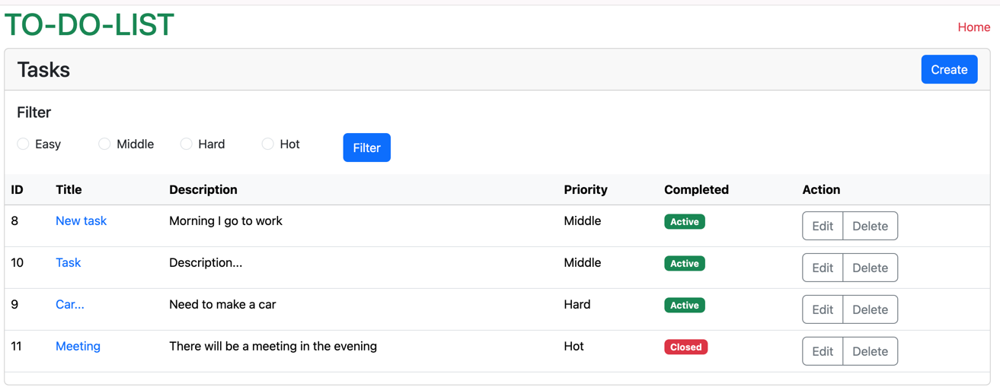

## Laravel v11 | Bootstrap v5

## Setup

```
composer install
php artisan migrate
php artisan db:seed
```

## Test
```
php artisan sync:weather 
php artisan sync:weather --city=London 
php artisan sync:weather --city=Lviv --country=UA
```




